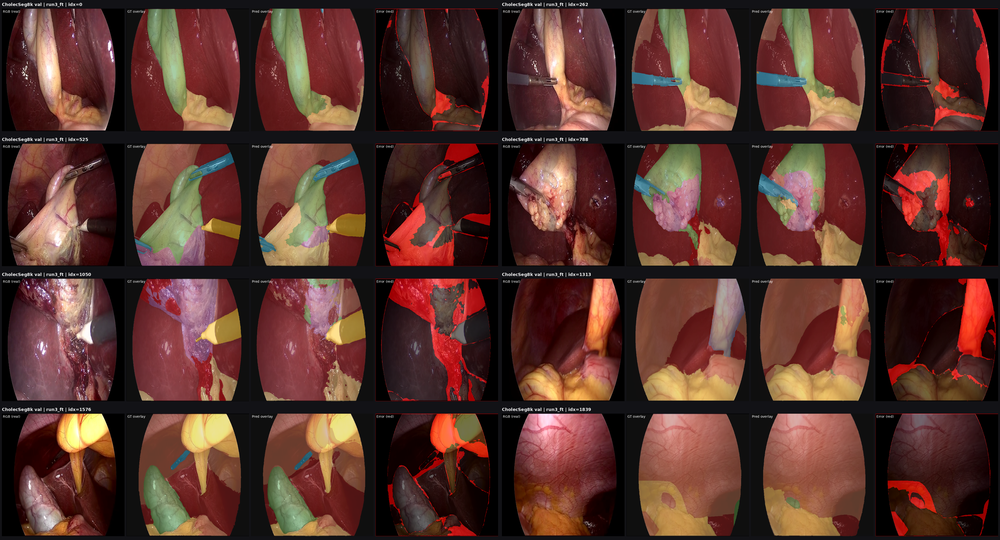
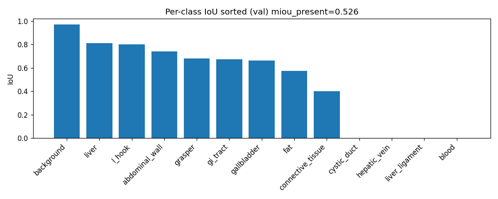
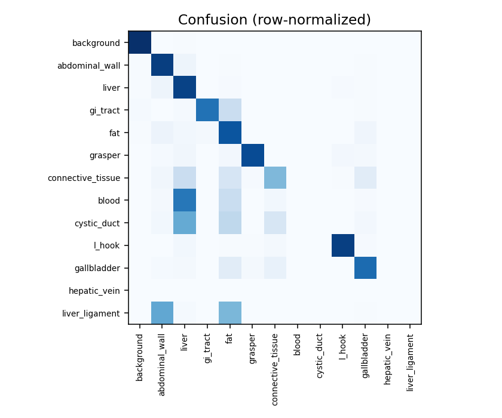
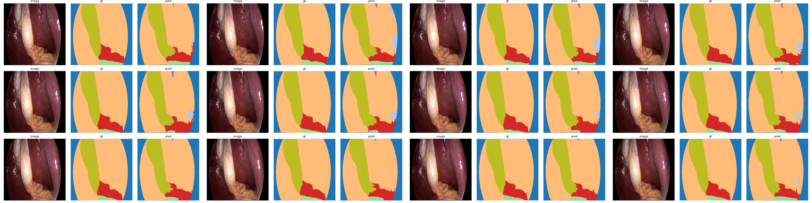
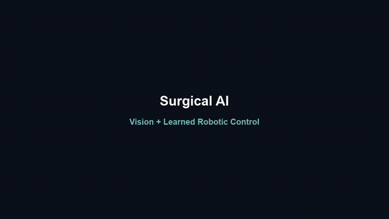
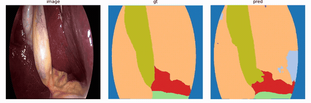
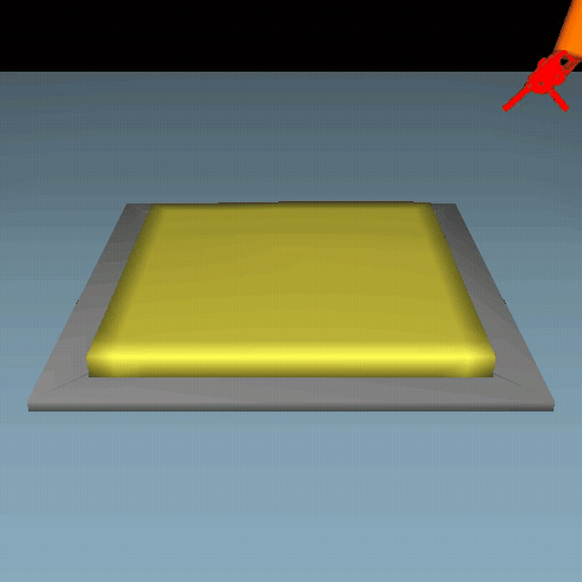
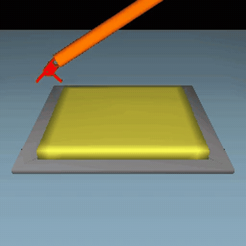

# Surgical AI: Vision and Robotic Control

 
**Topic:** Real laparoscopic semantic segmentation (CholecSeg8k / DeepLabV3+) plus TissueRetraction control (sofa_env) with RGB Behavior Cloning

## Final delivery

| Item | Path |
|------|------|
| Slides (PPTX) | [`docs/DEFENSE_SLIDES_FINAL_ENGLISH.pptx`](docs/DEFENSE_SLIDES_FINAL_ENGLISH.pptx) |
| Demo reel | [`outputs/defense_bundle/videos/DEFENSE_DEMO_REEL_V2.mp4`](outputs/defense_bundle/videos/DEFENSE_DEMO_REEL_V2.mp4) |
| Segmentation demo | [`outputs/defense_bundle/videos/segmentation_rgb_gt_prediction.mp4`](outputs/defense_bundle/videos/segmentation_rgb_gt_prediction.mp4) |
| Seg checkpoint | [`outputs/defense_bundle/checkpoints/run3_ft/best.pt`](outputs/defense_bundle/checkpoints/run3_ft/best.pt) |
| BC checkpoint | [`outputs/defense_bundle/checkpoints/bc_rgb_v2/best.pt`](outputs/defense_bundle/checkpoints/bc_rgb_v2/best.pt) |
| Report PDF | [`docs/FINAL_REPORT.pdf`](docs/FINAL_REPORT.pdf) |

Development only material is archived under `junk/` and is not required to run or evaluate the final project.

## Results (locked)

### Segmentation (`run3_ft`)

| Metric | Value |
|--------|------:|
| mIoU present | **0.526** |
| Dice present | **0.611** |

Strong classes: background, liver, abdominal wall, l-hook, grasper.  
Weak or zero: blood, cystic_duct, liver_ligament.

### Control (TissueRetraction)

| Controller | Success | Protocol |
|------------|--------:|----------|
| oracle | **1.000** | 5x100 |
| heuristic | **1.000** | 5x100 |
| random | **0.000** | 5x100 |
| synthetic_vision | **0.000** | slim |
| model_vision | **0.000** | slim |
| **bc_rgb_v2** | **1.000** | **5x40** (Wilson95 **[0.981, 1.000]**) |

`bc_rgb_v2` maps **RGB to action** only. It does **not** receive goal XYZ (`get_grasping_position` / `get_end_position` belong to oracle/heuristic).

## Visual results

### Segmentation panels (RGB, GT overlay, prediction, error)



### Per class IoU



### Confusion matrix



### Overlay contact sheet (image / GT / prediction)



## Videos

Previews below play automatically in the GitHub README (animated GIF). Full MP4 files are linked under each clip.

### Main demo reel

[](outputs/defense_bundle/videos/DEFENSE_DEMO_REEL_V2.mp4)

Full video: [`DEFENSE_DEMO_REEL_V2.mp4`](outputs/defense_bundle/videos/DEFENSE_DEMO_REEL_V2.mp4)

### Segmentation

[](outputs/defense_bundle/videos/segmentation_rgb_gt_prediction.mp4)

Full video: [`segmentation_rgb_gt_prediction.mp4`](outputs/defense_bundle/videos/segmentation_rgb_gt_prediction.mp4)

### Control: oracle reference

[](outputs/defense_bundle/videos/control_oracle_reference_success.mp4)

Full video: [`control_oracle_reference_success.mp4`](outputs/defense_bundle/videos/control_oracle_reference_success.mp4)

### Control: learned BC (RGB only)

[](outputs/defense_bundle/videos/control_bc_rgb_v2_success.mp4)

Full video: [`control_bc_rgb_v2_success.mp4`](outputs/defense_bundle/videos/control_bc_rgb_v2_success.mp4)

### All control MP4 files

| File | Role |
|------|------|
| [`control_oracle_reference_success.mp4`](outputs/defense_bundle/videos/control_oracle_reference_success.mp4) | Full state performance ceiling |
| [`control_heuristic_baseline_success.mp4`](outputs/defense_bundle/videos/control_heuristic_baseline_success.mp4) | Rule based baseline success |
| [`control_random_baseline_failure.mp4`](outputs/defense_bundle/videos/control_random_baseline_failure.mp4) | Random control failure baseline |
| [`control_synthetic_vision_bridge_failure.mp4`](outputs/defense_bundle/videos/control_synthetic_vision_bridge_failure.mp4) | HSV vision bridge failure |
| [`control_model_vision_bridge_failure.mp4`](outputs/defense_bundle/videos/control_model_vision_bridge_failure.mp4) | DeepLab vision bridge failure |
| [`control_bc_rgb_v2_success.mp4`](outputs/defense_bundle/videos/control_bc_rgb_v2_success.mp4) | Learned RGB to action success |
| [`control_bc_rgb_v2_success_seed7.mp4`](outputs/defense_bundle/videos/control_bc_rgb_v2_success_seed7.mp4) | Same learned policy, seed 7 |
| [`control_bc_rgb_v2_success_seed53.mp4`](outputs/defense_bundle/videos/control_bc_rgb_v2_success_seed53.mp4) | Same learned policy, seed 53 |

## Repo layout

```
configs/                 final segmentation and simulation YAML
docs/                    final report and defense slides
outputs/
  defense_bundle/
    checkpoints/         run3_ft and bc_rgb_v2
    metrics/             final evaluation JSON
    videos/              final reel and demos
    plots/               evaluation figures
    polish/              presentation panels
src/
  datasets/              CholecSeg8k
  models/                DeepLabV3+, losses, metrics
  sim/                   env, controllers, BC collect/train, vision bridge
  train_segmentation.py
  eval_segmentation.py
junk/                    archived development only material
```

## Setup

### Vision (Linux GPU recommended)

```bash
python3 -m venv .venvs/vision
source .venvs/vision/bin/activate
pip install torch torchvision --index-url https://download.pytorch.org/whl/cu124
pip install -r requirements.txt
```

### Simulation (Linux x86_64 only)

```bash
python3 -m venv .venvs/sim
source .venvs/sim/bin/activate
pip install -r requirements-sim.txt
```

## Reproduce

### Segmentation eval

```bash
python src/eval_segmentation.py \
  --checkpoint outputs/defense_bundle/checkpoints/run3_ft/best.pt \
  --split val \
  --output outputs/metrics/seg_eval_run3_ft.json
```

### Controllers

```bash
# baselines
python src/sim/run_env.py --controller oracle --episodes 40 --seed 11
python src/sim/run_env.py --controller heuristic --episodes 40 --seed 11

# learned RGB BC (no GT pose)
python src/sim/run_env.py --controller bc_rgb \
  --checkpoint outputs/defense_bundle/checkpoints/bc_rgb_v2/best.pt \
  --episodes 40 --seed 11 --max-steps 400
```

### BC data collection and training (server)

```bash
python src/sim/collect_bc.py \
  --config configs/simulation.yaml \
  --out data/bc_oracle \
  --episodes 100 --max-steps 300 --img-size 64

python src/sim/train_bc.py \
  --data data/bc_oracle/demos.npz \
  --out outputs/checkpoints/bc_rgb_v2/best.pt \
  --arch strong --epochs 40 --batch-size 128 --lr 8e-4 --aug
```

## Honesty and scope

* **Trained:** DeepLabV3+ on real frames; RGB to action BC from oracle demos.
* **Not a silent GT clone:** vision bridge success is 0; BC at test time sees pixels only.
* **Scope:** TissueRetraction in sofa_env, not a physical robot.

## Links

| Item | URL |
|------|-----|
| GitHub | https://github.com/nikimahdian/MachineVision-KNTU-SurgicalAI |
| CholecSeg8k | https://arxiv.org/abs/2012.12453 |
| LapGym | https://jmlr.org/papers/v24/23-0207.html |
| sofa_env | https://github.com/ScheiklP/sofa_env |
